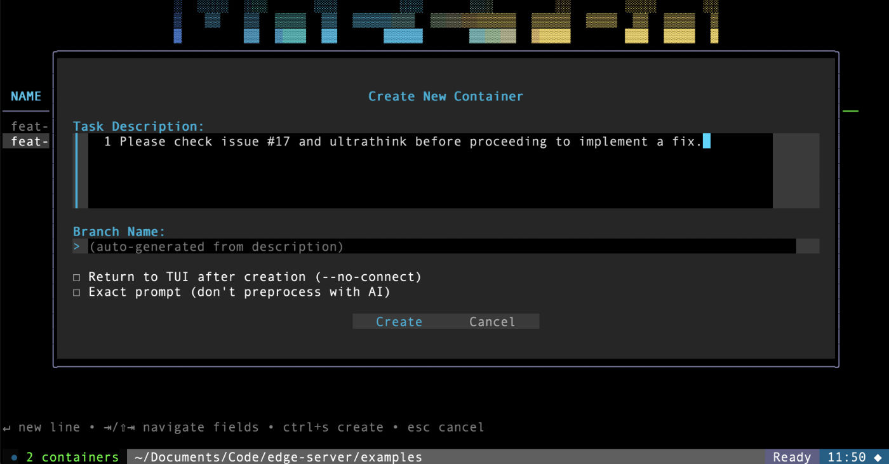

# Maestro - Multi-Container Claude

Run multiple isolated Claude Code instances in parallel (or other AI agents), each in their own Docker container with automatic branch management, network firewalls, and full development environment.

## What is Maestro?

Maestro lets you work on multiple tasks simultaneously with Claude Code. Each task runs in its own isolated Docker container with:

- 🌳 **Automatic git branches** - Maestro creates appropriately named branches for each task
- 🔥 **Network firewall** - Containers can only access whitelisted domains
- 📦 **Complete isolation** - Full copy of your project in each container
- 🔔 **Activity monitoring** - See which tasks need your attention
- 🤖 **Background daemon** - Auto-monitors token expiration and sends notifications
- ♻️ **Persistent state** - npm/UV caches and command history survive restarts



## Quick Install

```bash
curl -fsSL https://raw.githubusercontent.com/uprockcom/maestro/main/install.sh | bash
```

**Prerequisites:** Docker must be installed and running.

This installs the `maestro` binary and pulls the Docker image.

### Build from Source

```bash
git clone https://github.com/uprockcom/maestro.git
cd maestro
make all              # Build binary + Docker image
sudo make install     # Install to /usr/local/bin
```

### Windows

```ps1
iew -ExecutionPolicy Bypass -Uri https://raw.githubusercontent.com/uprockcom/maestro/main/install.ps1 | iex
```

_Note: Windows installs and runs natively, but Docker Desktop is still required, and it is not tested as thoroughly as macOS/Linux._

## Getting Started

For the first run, you can just run `maestro` to start our interactive text UI, which will guide you through authentication and creating your first container. Alternatively, you can execute each step manually as follows:

### 1. Authenticate

Run once to set up Claude Code authentication:

```bash
maestro auth
```

This stores credentials in `~/.maestro/` and shares them (read-only) with all containers.

### 2. Configure (Optional)

Edit `~/.maestro/config.yml` to add additional folders and network domains:

```yaml
firewall:
  allowed_domains:
    - github.com
    - api.anthropic.com
    # Add your domains here

sync:
  additional_folders:
    - ~/Documents/Code/mcp-servers
    - ~/Documents/Code/helpers
```

You can also set firewall rules from the text UI using the `f` shortcut.

### 3. Create Your First Container

```bash
maestro new "implement OAuth authentication"
```

Maestro will:
1. Generate an appropriate branch name (e.g., `feat/oauth-auth`)
2. Create an isolated container with your project
3. Start Claude in planning mode
4. Connect you to the container automatically

_Note: After connecting, wait for a moment, and maestro will automatically input a prompt derived from your task description and hit enter
to start claude._

## Basic Usage

```bash
# Create a new container for a task
maestro new "fix API bug in users endpoint"
maestro new -f specs/design.md

# List all containers with status
maestro list

# Connect to a container
maestro connect feat-oauth-1

# Stop a container
maestro stop feat-oauth-1

# Clean up stopped containers
maestro cleanup
```

### Inside a Container

When connected via `maestro connect`:

- **Window 0**: Claude Code (auto-approve mode)
- **Window 1**: Shell for manual commands
- **Switch windows**: `Ctrl+b 0` or `Ctrl+b 1`
- **Detach**: `Ctrl+b d` (container keeps running)

### Background Daemon

_Note: Not tested on Windows._

Start the daemon to monitor containers and get desktop notifications:

```bash
maestro daemon start

# Check status
maestro daemon status

# View logs
maestro daemon logs
```

The daemon monitors:
- Token expiration (warns when < 1 hour remaining)
- Container attention needs (bell indicators)
- Automatic health checks every 30 minutes

## Container Status

The `maestro list` command shows comprehensive status:

```
NAME              STATUS   BRANCH         GIT      ACTIVITY  AUTH
----              ------   ------         ---      --------  ----
feat-oauth-1      running  feat/oauth     Δ23 ↑2   2m ago    ✓ 147h    🔔
fix-api-bug-1     running  fix/api-bug    ✓        5m ago    ⚠ 2h
refactor-db-1     stopped  refactor/db    Δ5       12h ago   ✗ EXPIRED
```

**Indicators:**
- **GIT**: `Δ23` = 23 changes, `↑2` = 2 commits ahead, `↓1` = 1 behind, `✓` = clean
- **AUTH**: `✓` valid, `⚠` expiring soon (< 24h), `✗` expired
- **🔔**: Container needs attention
- **💤**: Dormant (Claude exited)

## Token Management

Claude tokens expire after 8 hours. Whichever session next connects will get the refresh and the others will all get auth errors. Maestro makes this easy:

```bash
# Check token status for all containers
maestro list

# Refresh tokens (copies freshest token from any active containers)
maestro refresh-tokens

# Re-authenticate if all tokens expired
maestro auth
```

The daemon automatically warns you about expiring tokens and supports auto-refresh.

## Network Firewall

By default, containers can only access whitelisted domains from your config. To temporarily add a domain:

```bash
maestro add-domain feat-oauth-1 api.example.com
```

Maestro will offer to save it permanently to your config.

## Documentation

- **[Complete Usage Guide](docs/GUIDE.md)** - Detailed documentation, configuration, troubleshooting
- **[Architecture Details](docs/GUIDE.md#architecture)** - Container structure, volumes, authentication
- **[Development Guide](docs/GUIDE.md#development)** - Building, testing, modifying Maestro

## Requirements

- **Docker** - Must be running ([install](https://www.docker.com/get-started))
- **Claude Code** - Authentication via `maestro auth`
- **Go 1.25+** - Only needed if building from source

## About

Maestro is built by [UpRock](https://prism.uprock.com/), powering distributed uptime monitoring and next gen AI crawling.
Run your agents with Maestro, ship faster, and verify every deploy doesn't break production with a single Uptime prompt on millions of real devices worldwide.

## License

Apache 2.0 - See [LICENSE](LICENSE) file for details.